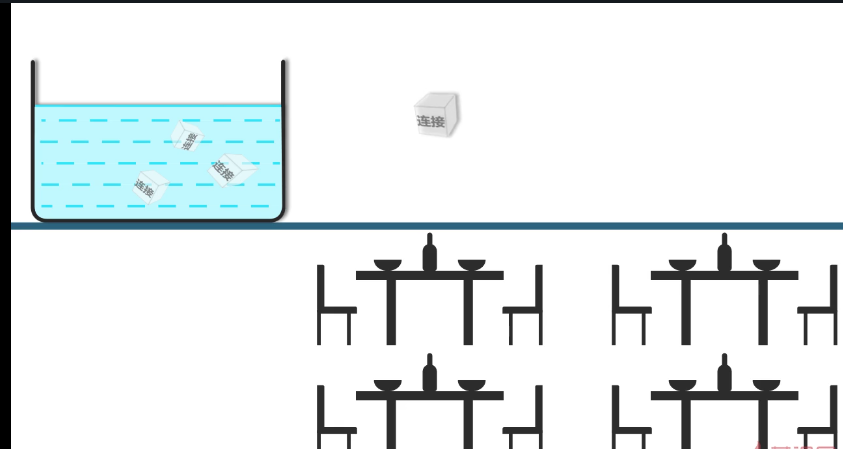
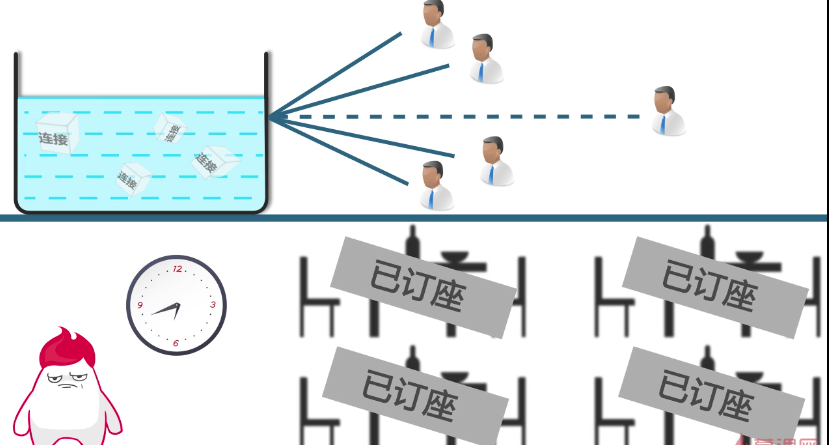
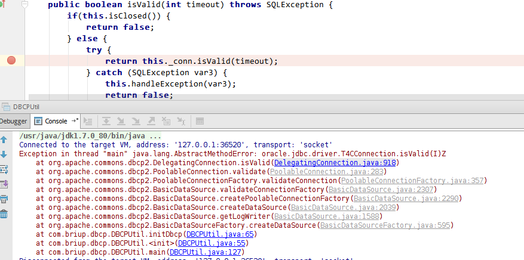
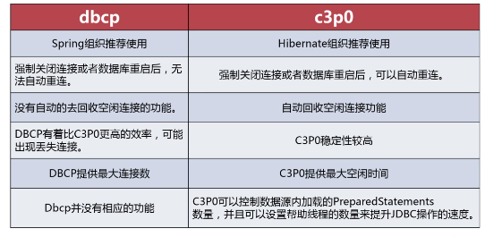

## JDBC之连接池DBCP与c3p0的简单使用

[TOC]

提示：本内容通过慕课网学习后写的笔记
源码：https://github.com/caojx-git/learn/tree/master/code/jdbc_examples

### 一、背景

数据库是一种重要的资源，我们普通的做法是使用直连方法连接数据库，使用完毕后关闭连接。  
假如部署了一个很大的项目，访问量很大，如果使用直接连接方式每个客户端连接都会创建一个连接，  
这样频繁的数据库连接方式会给数据库很大的压力，这样很容易导致数据库崩溃，然后项目网站也就瘫痪了。  
正是针对这样的问题，出现了数据库连接池技术。

数据库连接池技术的大致思路：  

我们使用连接池技术先创建好一定数量的连接，即连接池中保持一定数量的连接，当需要使用的时候，从连接池中取出一个连接，  
当使用完成后，释放连接，放回连接池，当连接用户请求连接数比较大，连接池中的连接不够用的时候，再用户等待。  

连接池中保持一定数量的连接：  



请求人数过多等待：  



### 二、常用的开源数据库连接池

#### 2.1 dbcp

步骤：

1. 导入相关jar包  
    commons-dbcpxxx.jar     
    commons-poolxxx.jar   
    commons-loggingxxx.jar    
    提示：jar包可以去http://mvnrepository.com/下载  
2. 在项目的src文件夹下增加配置文件    
    dbcp.properties  

```properties
driverClassName=oracle.jdbc.driver.OracleDriver
url=jdbc:oracle:thin:@localhost:1521:XE
username=myoracle
password=myoracle
maxActive=30
maxIdle=10
minIdle=1
maxWait=10000
initialSize=5
removeAbandoned=true
removeAbandonedTimeout=300
```

3. dbcp.properties文件内容的字段说明  

| 属性名                           | 属性描述                                     | 属性值                                      |
| ----------------------------- | ---------------------------------------- | ---------------------------------------- |
| driverClassName               | 使用的JDBC的完整的有<br/>效的java类名称               | com.mysql.jdbc.Driver                    |
| url                           | 传递给JDBC驱动的用于建立连接的url                     | jdbc:mysql://localhost:3306/test?<br/>useUnicode=true&characterEncoding=UTF-8 |
| username                      | 传递给JDBC驱动用于建立连接的用户名                      | myoracle                                 |
| password                      | 传递给JDBC驱动用于建立连接的密码                       | myoracle                                 |
| maxActive                     | 最大活动连接数:连接池在同一时间能够<br/>分配的最大活动连接的数量，<br/>如果设置为非正数，则表示不受限制 | 30                                       |
| maxIdle                       | 最大空闲连接数:连接池中容许保持最大<br/>空闲状态的最大链接数量，操作的空闲连接将被释放，<br/>如果设置为负数表示不受限制 | 10                                       |
| minIdle                       | 最小空闲连接数:连接池中容许保持最小<br/>空闲状态的最大链接数量，操作的空闲连接将被释放，<br/>如果设置为负数表示不受限制 | 1                                        |
| maxWait                       | 最大等待时间：当没有可用连接时，连接池等待<br/>连接被归还的最大时间(以毫秒计数),超过时间则抛出异常，<br/>如果设置为-1则表示无限等待 | 1000                                     |
| initialSize                   | 初始连接:池启动时创建的连接数量                         | 1                                        |
| logAbandoned                  | 连接被泄露时是否打印                               | true                                     |
| removeAbandoned               | 是否自动回收超时连接                               | true                                     |
| removeAbandoned Timeout       | 超时时间(以秒数为单位)                             | 10                                       |
| timeBetweenEvictionRunsMillis | 在空闲连接回收器线程运行期间休眠的时间值,<br/>以毫秒为单位         | 1000                                     |
| numTestsPerEvictionRun        | 在每次空闲连接回收器线程(如果有)运行时检查的连接数量              | 10                                       |
| minEvictableIdleTimeMillis    | 连接在池中保持空闲而不被空闲连接回收器线程                    | 10000                                    |


推荐文章：http://bsr1983.iteye.com/blog/2092467


使用案例：
```java
import org.apache.commons.dbcp2.BasicDataSource;
import org.apache.commons.dbcp2.BasicDataSourceFactory;
import org.omg.CORBA.Object;

import javax.sql.DataSource;
import java.sql.Connection;
import java.sql.SQLException;
import java.util.Properties;

/**
 * Description:使用dpcp连接池连接数据库
 *
 * @author caojx
 *         Created by caojx on 2017年04月06 下午11:06:06
 */
public class DBCPUtil {

    /**
     * 数据源
     */
    private static DataSource DS;

    private static String configFile = "/dbcp.properties";

    /**
     * @return
     * @Description: 从数据源获取一个连接
     */
    public Connection getConnection() {
        Connection connection = null;
        if (DS != null) {
            try {
                connection = DS.getConnection();
            } catch (SQLException e) {
                e.printStackTrace();
            }

            try {
                connection.setAutoCommit(false);
            } catch (SQLException e) {
                e.printStackTrace();
            }
            return connection;
        }
        return connection;
    }

    /**
     * 默认的构造函数
     */
    public DBCPUtil() {
        this.initDbcp();
    }

    /**
     * @Description: 方式一，DBCP通过读取配置文件获取参数后，通过BasicDataSourceFactory获取DataSource
     */
    private static void initDbcp() {
        Properties properties = new Properties();
        try {
            properties.load(Object.class.getResourceAsStream(configFile));
            DS = BasicDataSourceFactory.createDataSource(properties);
        } catch (Exception e) {
            e.printStackTrace();
        }
    }

    /**
     * 构造函数，初始化了DS，指定数据库
     */
    public DBCPUtil(String connectURI) {
        initDS(connectURI);
    }

    /**
     * 构造函数，初始化DS，制定所有参数
     */
    public DBCPUtil(String connectURI, String username, String password, String driverClass,
                    int initialSize, int maxActive, int maxIdle,
                    int maxWait, int minIdle) {
        initDS(connectURI, username, password, driverClass, initialSize, maxActive, maxIdle, maxWait, minIdle);

    }

    /**
     * @param connectURI 数据库
     * @return
     * @Description 创建数据源，除了数据库外，都使用默认的参数
     */
    public static void initDS(String connectURI) {
        initDS(connectURI, "myoracle", "myoracle", "oracle.jdbc.driver.OracleDriver", 5, 30, 10, 1, 1000);
    }

    /**
     * @param connectURI
     * @param username
     * @param password
     * @param driverClass
     * @param initialSize
     * @param maxActive
     * @param maxIdle
     * @param maxWait
     * @param minIdle
     * @Description: 方式二，手动给创建DataSource，并给其设置参数
     */
    public static void initDS(String connectURI, String username, String password, String driverClass,
                              int initialSize, int maxActive, int maxIdle,
                              int minIdle, int maxWait) {
        BasicDataSource dataSource = new BasicDataSource();
        dataSource.setDriverClassName(driverClass);
        dataSource.setUsername(username);
        dataSource.setPassword(password);
        dataSource.setUrl(connectURI);
        dataSource.setInitialSize(initialSize);
        dataSource.setMaxTotal(maxActive);
        dataSource.setMaxIdle(maxIdle);
        dataSource.setMaxWaitMillis(maxWait);
        dataSource.setMinIdle(minIdle);
        DS = dataSource;
    }


    public static void main(String[] args) {

        System.out.println(new DBCPUtil().getConnection());
    }

}

```

注意：如果jdbc驱动包使用不对，会出现如下错误，更换jdbc包后可解决。


#### 2.2 c3p0
官网：http://www.mchange.com/projects/c3p0/  
c3p0是一个开源的JDBC连接池，他实现了数据源和JNDI绑定，支持JDBC3和JDBC2的标准扩展。

步骤：

1. 导入相关的jar包
  c3p0-0.9.5.2.jar  
  mchange-commons-java-0.2.10.jar  
  c3p0-oracle-thin-extras-0.9.5.jar(oracle专用jar)  
  提示：jar包可以去http://mvnrepository.com/下载  

2. 在项目的src文件夹下增加配置文件
  c3p0.properties

```properties
c3p0.driverClass=oracle.jdbc.driver.OracleDriver
c3p0.jdbcUrl=jdbc:oracle:thin:@127.0.0.1:1521:XE
c3p0.user=myoracle
c3p0.password=myoracle
```
其他配置参数：  
http://blog.csdn.net/yixiayizi/article/details/8277424    
http://www.mchange.com/projects/c3p0/  

3. 编写类文件，创建连接池

```java
import com.mchange.v2.c3p0.ComboPooledDataSource;

import java.sql.Connection;
import java.sql.SQLException;

/**
 * Description: 测试c3p0连接池
 * 
 * Created by caojx on 2017年04月07 上午12:26:26
 */
public class C3P0Util {

    private static ComboPooledDataSource dataSource = new ComboPooledDataSource();

    public static Connection getConnection() {
        try {
            return  dataSource.getConnection();
        } catch (SQLException e) {
            throw  new RuntimeException(e);
        }
    }

    public static void main(String[] args){
        System.out.println(C3P0Util.getConnection());
    }
}
```

### 三、dbcp与c3p0对比



推荐文章：  
http://bsr1983.iteye.com/blog/2092467  
http://blog.csdn.net/yixiayizi/article/details/8277424  
