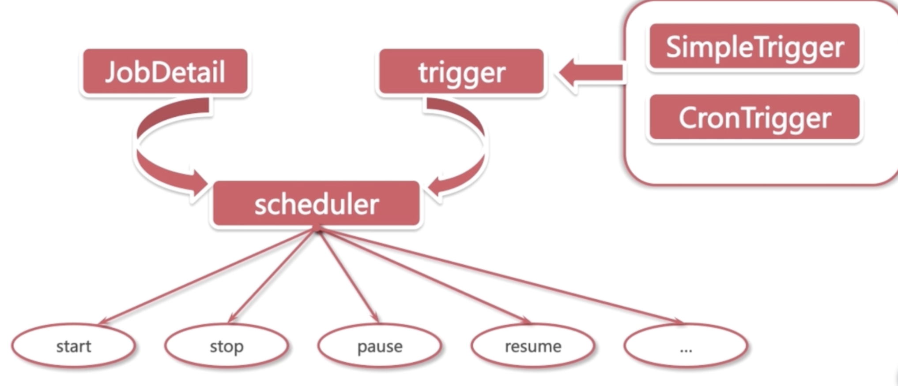
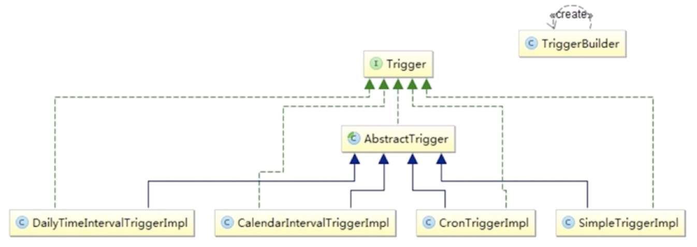
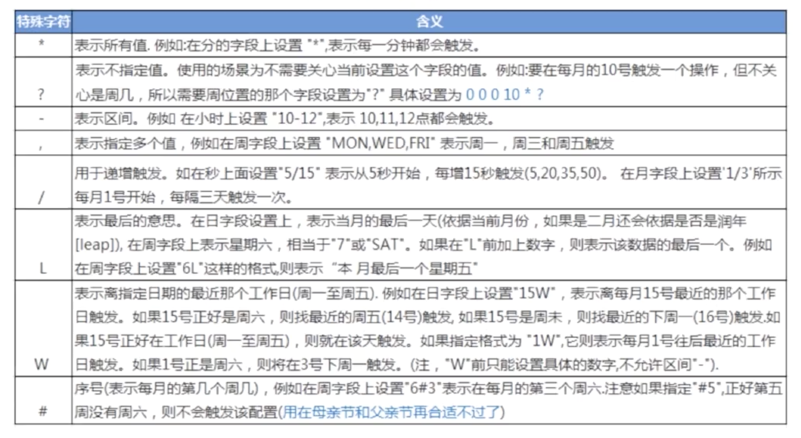
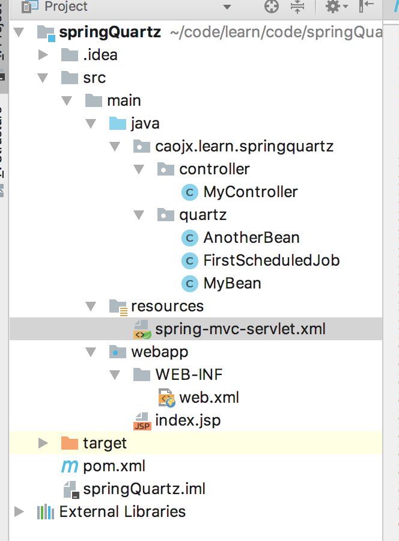
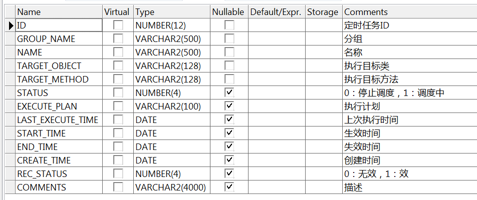
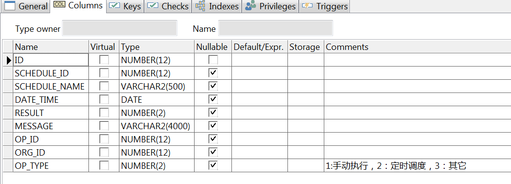

# Java定时任务之Quartz

[TOC]

本文笔记源自慕课网视频教程：https://www.imooc.com/learn/846整出。  
练习源码:https://github.com/caojx-git/learn/tree/master/code/spring-quartz  

## 一、简介
Quartz是OpenSymphony开源组织在Job scheduling领域又一个开源项目，它可以与J2EE与J2SE应用程序相结合也可以单独使用。Quartz可以用来
创建简单或为运行十个，百个，甚至是好几万个Jobs这样复杂的程序。Jobs可以做成标准的Java组件或 EJBs。Quartz的最新版本为Quartz 2.3.0。
--来自百度

官网：http://www.quartz-scheduler.org/

### 1.1 特点
1. 强大的调度功能  
作为Spring默认的调度框架，可以很容易与spring集成，实现灵活可配置的调度功能，并且quartz还提供了调度运行环境的持久化机制，可以保存并恢复调度
现场，即使系统因故障关闭，任务调度现场数据并不会丢失。  
2. 灵活的应用方式  
可以灵活的定义触发器的调度时间表，并且可以对任务和触发器进行关联映射，quartz提供了组件式的监听器、各种插件、线程池等功能，支持任务和调度的
多种组合方式、支持调度数据的多种存储方式。  
3. 分布式和集群能力

### 1.2 主要使用的设计模式

- Builder模式
  如创建Trigger、Job等
- Factory模式
  调度器主要使用工厂模式创建
- 组件模式
- 链式写法

### 1.3 三个核心概念

1. 任务：处理业务逻辑
2. 触发器：调度器触发的时间
3. 调度器：负责定时定频率的执行任务

即：Job、Trigger、Scheduler

### 1.4 Quartz体系结构

    

JobDetail:任务，包含了任务的实现类，以及类的信息  
Trigger:触发器，决定任务什么时候被调用  
scheduler:调度器，将JobDetail绑定在一起，能够定时定频率的执行JobDetail  

重要组成：
- Job：接口，取决于我们的JobDetail，只有一个方法，开发者可以实现该方法，并运行任务，相当于Java中的TimerTask里边的run方法。
- JobDetail: quartz在每次执行job的时候，会重新创建一个JobDetail实例，所以它不直接接受一个job实例，相反它接受一个job实现类，以编译运行时，
通过newinstance的反射机制实例化Job，因此需要一个类来描述job的实现类以及其他相关的静态信息，如Job的名字、描述、关联监听器等信息，JobDetail
就充当了这个角色。
- JobBuilder：用来定义或者创建JobDetail实例。
- JobStore：接口，用来保存Job数据。
- Trigger：用于描述触发Job的执行时间，触发规则信息。
- TriggerBuilder：用来定义或创建触发器的实例。
- ThreadPool：不同于Timer有且仅有一个后台线程在执行，quartz支持多线程，可以设置quartz执行过程中的线程池大小。
- Scheduler：调度器，代表quartz的一个独立运行的容器，Trigger和Job可以注射到Scheduler中，两者在scheduler中拥有各自的组及名称，组及名称
是scheduler查找容器中某一对象的依据，Trigger组及名称必须唯一，Job和Detail的组及名称也必须唯一，但是Job和trigger的组以名称是可以相同，因为
他们是不同类型的，scheduler中定义了多个接口方法，允许外部通过组及名称访问可以控制scheduler容器中的Trigger、JobDetail。
- Calendar：一个Trigger可以和多个Calendar关联，以排除或包含某些时间点。
- 监听器：
 JobListener、TriggerListener、SchedulerListener

 ## 二、第一个Quartz程序

 准备工作：  
 - 建立maven工程
 - 引入Quartz.jar包  

 案例：使用Quartz实现每2s中打印一次hello job   

 ### 2.1 HelloJob.java
 ```java
package caojx.learn.springquartz.base;

import org.quartz.Job;
import org.quartz.JobExecutionContext;
import org.quartz.JobExecutionException;

import java.text.SimpleDateFormat;
import java.util.Date;

/**
 * 定义一个HelloJob类实现Job接口
 */
public class HelloJob implements Job{

    /**
     * execute里边用于编写具体的业务逻辑，与TimerTask里边的run相似
     */
    public void execute(JobExecutionContext jobExecutionContext) throws JobExecutionException {
        //编写具体的业务逻辑

        //打印当前执行的时间
        Date date = new Date();
        SimpleDateFormat simpleDateFormat = new SimpleDateFormat("yyyy-MM-dd HH:mm:ss");
        System.out.println("Current Exec Time is:"+simpleDateFormat.format(date));
        System.out.println("hello job！");
    }
}
 ```

### 2.2 HelloScheduler.java  
scheduler将job与trigger绑定实现每2s中打印一次hello job  
```java
package caojx.learn.springquartz.base;

import org.quartz.*;
import org.quartz.impl.StdSchedulerFactory;

public class HelloScheduler {

    public static void main(String[] args) throws SchedulerException {
        //1.创建一个JobDetail实例，将该类与HelloJob Class绑定
        JobDetail jobDetail = JobBuilder.newJob(HelloJob.class).withIdentity("myJob", "group1").build();
        //2.创建一个Trigger实例，定义该Job立即执行，并且每个两秒重复执行一次,注意trigger中的group1与job中的group1不是同一个组，因为她们不是同一种对象
        Trigger trigger = TriggerBuilder.newTrigger().withIdentity("myTrigger", "group1").startNow().withSchedule(SimpleScheduleBuilder.simpleSchedule().withIntervalInSeconds(2).repeatForever()).build();
        //3.创建Scheduler实例
        SchedulerFactory schedulerFactory = new StdSchedulerFactory();
        Scheduler scheduler = schedulerFactory.getScheduler();
        scheduler.start();
        //4.将jobDetail与trigger绑定
        scheduler.scheduleJob(jobDetail,trigger);

    }
}
```

## 三、浅谈Quartz

### 3.1 浅谈Job与JobDetail

1. 浅谈Job

- Job的定义  
实现业务逻辑任务的接口，Job接口非常容易实现，只有一个execute方法，类似于TimerTask的run方法，在里边编写业务逻辑。  
- Job实例在Quartz中的生命周期  
每次调度器执行job时，它在调用execute方法前会创建一个新的job实例。  
当调用完成后，关联的job对象实例会被释放，释放的实例会被垃圾回收。  

2. 浅谈JobDetail  
JobDetail为Job实例提供了许多设置属性，以及JobDataMap成员变量属性，它用来存储特定的job实例的状态信息，调度器需要借助JobDetail对象来添加Job
实例。

jobDetail中的几个重要的属性：  
- name:任务的名称，在JobDetail中是必须的
- group:任务所在的组，在JobDetail中是必须的，默认是DEFAULT  
- jobClass:任务的实现类，在JobDetail中是必须的  
- jobDataMap:用来实现在传参数  

3. 打印Job的相关属性

```java
package caojx.learn.springquartz.base;

import org.quartz.*;
import org.quartz.impl.StdSchedulerFactory;

public class HelloScheduler {

    public static void main(String[] args) throws SchedulerException {
        //1.创建一个JobDetail实例，将该类与HelloJob Class绑定
        JobDetail jobDetail = JobBuilder.newJob(HelloJob.class).withIdentity("myJob", "group1").build();

        System.out.println("jobDetail's name:"+jobDetail.getKey().getName());
        System.out.println("jobDetail's group:"+jobDetail.getKey().getGroup());
        System.out.println("jobDetail's jobClass:"+jobDetail.getJobClass().getName());

        //2.创建一个Trigger实例，定义该Job立即执行，并且每个两秒重复执行一次,注意trigger中的group1与job中的group1不是同一个组，因为她们不是同一种对象
        Trigger trigger = TriggerBuilder.newTrigger().withIdentity("myTrigger", "group1").startNow().withSchedule(SimpleScheduleBuilder.simpleSchedule().withIntervalInSeconds(2).repeatForever()).build();
        //3.创建Scheduler实例
        SchedulerFactory schedulerFactory = new StdSchedulerFactory();
        Scheduler scheduler = schedulerFactory.getScheduler();
        scheduler.start();
        //4.将jobDetail与trigger绑定
        scheduler.scheduleJob(jobDetail,trigger);

    }
}
```

结果：  
```text
jobDetail's name:myJob
jobDetail's group:group1
jobDetail's jobClass:learn.caojx.HelloJob
Current Exec Time is:2018-01-07 20:51:03
hello job！
```

### 3.2 浅谈JobExecutionContext获取上下文参数

1. JobExecutionContext是什么    
- 当Scheduler调用一个Job，就会将JobExecutionContext传递给Job的execute()方法。  
- job能国通JobExecutionContext对象访问到Quartz运行时的环境以及Job本身的明细数据。    

2. JobDataMap是什么  
- 在进行任务调度时JobDataMap存储在JobExecutionContext中，非常方便获取。
- JobDataMap可以用来装载任何可以序列化的数据对象，当job实例对象被执行时候这些参数对象会传递给它。
- JobDataMap实现了JDK的Map接口，并且添加了一些非常方便的方法来存取基本数据类型。

3. JobDataMap的两种方式    
- 从Map中直接获取  
- Job实现类中添加setter方法对应JobDataMap的键值获取（Quartz框架默认的JobFactory实现类在初始化job实例对象时会自动调用这些setter方法）

4. 从Map中直接获取  

从jobExecutionContext中获取JobDetai和Trigger中传入的参数

> HelloScheduler2.java

在JobDetail和Trigger中传入参数
```java
package caojx.learn.springquartz.base;

import org.quartz.*;
import org.quartz.impl.StdSchedulerFactory;

public class HelloScheduler2 {

    public static void main(String[] args) throws SchedulerException {
        //1.创建一个JobDetail实例,并添加一些附加参数
        JobDetail jobDetail = JobBuilder.newJob(HelloJob2.class).withIdentity("myJob", "group1")
                .usingJobData("message","myJob1")
                .usingJobData("FloatJobValue",3.14F)
                .build();

        //2.创建一个Trigger实例,并添加一些附加参数
        Trigger trigger = TriggerBuilder.newTrigger().withIdentity("myTrigger", "group1")
                .usingJobData("message","hello myTrigger1")
                .usingJobData("DoubleTriggerValue", 2.0D)
                .startNow().withSchedule(SimpleScheduleBuilder.simpleSchedule().withIntervalInSeconds(2).repeatForever()).build();

        //3.创建Scheduler实例
        SchedulerFactory schedulerFactory = new StdSchedulerFactory();
        Scheduler scheduler = schedulerFactory.getScheduler();
        scheduler.start();
        //4.将jobDetail与trigger绑定
        scheduler.scheduleJob(jobDetail,trigger);

    }
}
```

> HelloJob2.java

从jobExecutionContext中获取JobDetail和Trigger中传入的参数  

```java
package caojx.learn.springquartz.base;

import org.quartz.*;

import java.text.SimpleDateFormat;
import java.util.Date;

/**
 * 定义一个HelloJob类实现Job接口,从Map中获取传入的参数
 */
public class HelloJob2 implements Job{

    /**
     * execute里边用于编写具体的业务逻辑，与TimerTask里边的run相似
     */
    public void execute(JobExecutionContext jobExecutionContext) throws JobExecutionException {
        //打印当前执行的时间,并且获取jobExecutionContext的参数
        Date date = new Date();
        SimpleDateFormat simpleDateFormat = new SimpleDateFormat("yyyy-MM-dd HH:mm:ss");
        System.out.println("Current Exec Time is:"+simpleDateFormat.format(date));

        //获取JobDetail的信息
        JobKey jobKey = jobExecutionContext.getJobDetail().getKey();
        System.out.println("My Job name and group are:"+jobKey.getName()+":"+jobKey.getGroup());

        JobDataMap jobDataMap = jobExecutionContext.getJobDetail().getJobDataMap();
        String jobMessage = jobDataMap.getString("message");
        Float floatJobValue = jobDataMap.getFloat("FloatJobValue");

        System.out.println("JobMessage is :"+jobMessage);
        System.out.println("JobFloatValue is :"+floatJobValue);

        //获取Trigger的信息
        TriggerKey triggerKey = jobExecutionContext.getTrigger().getKey();
        System.out.println("My Trigger name and group are:"+triggerKey.getName()+":"+triggerKey.getGroup());


        JobDataMap triggerDataMap = jobExecutionContext.getTrigger().getJobDataMap();
        String triggerMessage = triggerDataMap.getString("message");
        Double triggerDoubleValue = triggerDataMap.getDouble("DoubleTriggerValue");

        System.out.println("TriggerMessage is :"+triggerMessage);
        System.out.println("TriggerDoubleValue is :"+triggerDoubleValue);
        
        //同时获取JobDetail和Trigger中的信息getMergedJobDataMap方式获取传入参数，如果存在相同的key则前边传入key会覆盖后边的key
        JobDataMap dataMap = jobExecutionContext.getMergedJobDataMap();
        String msg = dataMap.getString("message");
        Float jobFloatValue = dataMap.getFloat("FloatJobValue");
        Double tDoubleValue = dataMap.getDouble("DoubleTriggerValue");
        System.out.println("jobFloatValue is :"+jobFloatValue);
        System.out.println("msg is :"+jobFloatValue);
        System.out.println("triggerDoubleValue is :"+tDoubleValue);
    }
}
```
结果：  
```text
Current Exec Time is:2018-01-07 21:22:44
My Job name and group are:myJob:group1
JobMessage is :myJob1
JobFloatValue is :3.14
My Trigger name and group are:myTrigger:group1
TriggerMessage is :hello myTrigger1
TriggerDoubleValue is :2.0
jobFloatValue is :3.14
msg is :3.14
triggerDoubleValue is :2.0
```

5. Job实现类中添加setter方法对应JobDataMap的键值获取

```text
package caojx.learn.springquartz.base;

import org.quartz.*;

import java.text.SimpleDateFormat;
import java.util.Date;

/**
 * 定义一个HelloJob类实现Job接口,通过在Job中定义JobDataMap中对应的key属性并且提供get和setter方法就可以注入对应的参数值
 */
public class HelloJob3 implements Job{

    private String message;
    private Float floatJobValue;
    private Double doubleTriggerValue;

    public String getMessage() {
        return message;
    }

    public void setMessage(String message) {
        this.message = message;
    }

    public Float getFloatJobValue() {
        return floatJobValue;
    }

    public void setFloatJobValue(Float floatJobValue) {
        this.floatJobValue = floatJobValue;
    }

    public Double getDoubleTriggerValue() {
        return doubleTriggerValue;
    }

    public void setDoubleTriggerValue(Double doubleTriggerValue) {
        this.doubleTriggerValue = doubleTriggerValue;
    }

    /**
     * execute里边用于编写具体的业务逻辑，与TimerTask里边的run相似
     */
    public void execute(JobExecutionContext jobExecutionContext) throws JobExecutionException {
        //打印当前执行的时间,并且获取jobExecutionContext的参数
        Date date = new Date();
        SimpleDateFormat simpleDateFormat = new SimpleDateFormat("yyyy-MM-dd HH:mm:ss");
        System.out.println("Current Exec Time is:"+simpleDateFormat.format(date));

        //获取JobDetail的信息
        JobKey jobKey = jobExecutionContext.getJobDetail().getKey();
        System.out.println("My Job name and group are:"+jobKey.getName()+":"+jobKey.getGroup());

        //获取Trigger的信息
        TriggerKey triggerKey = jobExecutionContext.getTrigger().getKey();
        System.out.println("My Trigger name and group are:"+triggerKey.getName()+":"+triggerKey.getGroup());

        //提供和JobDataMap中对应key值的getter和setter方法后就可以获取到对应参数的值
        System.out.println("jobFloatValue is :"+floatJobValue);
        System.out.println("msg is :"+message);
        System.out.println("triggerDoubleValue is :"+doubleTriggerValue);
    }
}
```

结果：  
```text
Current Exec Time is:2018-01-07 21:50:15
My Job name and group are:myJob:group1
My Trigger name and group are:myTrigger:group1
jobFloatValue is :3.14
msg is :hello myTrigger1
triggerDoubleValue is :2.0
```

### 3.3 浅谈Trigger

1. 什么是Trigger
Quartz中的触发器用来告诉调度程序中也什么时候触发，即Trigger对象是用来触发执行Job的。  

2. Quartz框架中的Trigger    


Trigger主要是使用TriggerBuilder来创建的，这里我们主要了解的是CronTriggerImpl和SimpleTriggerImpl

3. 触发器通用属性   
- JobKey  
表示Job实例的标识，触发器被触发时，该指定的job实例会执行。  
- StartTime  
表示触发器的时间表首次被触发的时间，它的值得类型是Java.util.Date。    
- EndTime  
指定触发器的不在被触发的时间，它的值得类型是java.util.Date。

4. 定义Trigger的开始时间和结束时间的,来执行Job

TriggerTest1.java  
```java
package caojx.learn.springquartz.base;

import org.quartz.*;
import org.quartz.impl.StdSchedulerFactory; 
import sun.nio.cs.ext.SimpleEUCEncoder;

import java.text.SimpleDateFormat;
import java.util.Date;

/**
 * 定义Trigger执行的开始时间和结束时间
 */
public class TriggerTest1 {

    public static void main(String[] args) throws SchedulerException {
        //打印当前执行的时间,并且获取jobExecutionContext的参数
        Date date = new Date();
        SimpleDateFormat simpleDateFormat = new SimpleDateFormat("yyyy-MM-dd HH:mm:ss");
        System.out.println("Current Exec Time is:"+simpleDateFormat.format(date));

        //1.创建一个JobDetail实例
        JobDetail jobDetail = JobBuilder.newJob(TriggerTestJob1.class).withIdentity("myJob").build();

        //获取距离但钱时间3秒后的时间
        date.setTime(date.getTime()+3000);
        //获取距离但钱时间6秒后的时间
        Date endDate = new Date();
        endDate.setTime(endDate.getTime()+6000);

        //2.创建一个Trigger实例
        Trigger trigger = TriggerBuilder.newTrigger()
                .withIdentity("myTrigger","group1")
                .startAt(date)
                .endAt(endDate)
                .withSchedule(SimpleScheduleBuilder.simpleSchedule().withIntervalInSeconds(2).repeatForever()).build();

        //3.创建Scheduler实例
        SchedulerFactory schedulerFactory = new StdSchedulerFactory();
        Scheduler scheduler = schedulerFactory.getScheduler();
        scheduler.start();
        //4.将jobDetail与trigger绑定
        scheduler.scheduleJob(jobDetail,trigger);

    }
}
```

TriggerTestJob1.java
```java
package caojx.learn.springquartz.base;

import org.quartz.*;

import java.text.SimpleDateFormat;
import java.util.Date;

/**
 * 定义一个HelloJob类实现Job接口,通过在Job中定义JobDataMap中对应的key属性并且提供get和setter方法就可以注入对应的参数值
 */
public class TriggerTestJob1 implements Job{

    private String message;
    private Float floatJobValue;
    private Double doubleTriggerValue;

    public String getMessage() {
        return message;
    }

    public void setMessage(String message) {
        this.message = message;
    }

    public Float getFloatJobValue() {
        return floatJobValue;
    }

    public void setFloatJobValue(Float floatJobValue) {
        this.floatJobValue = floatJobValue;
    }

    public Double getDoubleTriggerValue() {
        return doubleTriggerValue;
    }

    public void setDoubleTriggerValue(Double doubleTriggerValue) {
        this.doubleTriggerValue = doubleTriggerValue;
    }

    /**
     * execute里边用于编写具体的业务逻辑，与TimerTask里边的run相似
     */
    public void execute(JobExecutionContext jobExecutionContext) throws JobExecutionException {
        //打印当前执行的时间,并且获取jobExecutionContext的参数
        Date date = new Date();
        SimpleDateFormat simpleDateFormat = new SimpleDateFormat("yyyy-MM-dd HH:mm:ss");
        System.out.println("Current Exec Time is:"+simpleDateFormat.format(date));

       Trigger currentTrigger = jobExecutionContext.getTrigger();
        System.out.println("start Time is:"+simpleDateFormat.format(currentTrigger.getStartTime()));
        System.out.println("end Time is:"+simpleDateFormat.format(currentTrigger.getEndTime()));

        JobKey jobKey = currentTrigger.getJobKey();
        System.out.println("Jobkey Info---jobName"+jobKey.getName()+"--jobGroup:"+jobKey.getGroup());
    }
}
```

结果：
```text
Current Exec Time is:2018-01-07 22:17:34
start Time is:2018-01-07 22:17:34
end Time is:2018-01-07 22:17:38
Jobkey Info---jobNamemyJob--jobGroup:DEFAULT
Current Exec Time is:2018-01-07 22:17:36
start Time is:2018-01-07 22:17:34
end Time is:2018-01-07 22:17:38
Jobkey Info---jobNamemyJob--jobGroup:DEFAULT
```

### 3.4 SimpleTrigger

1. SimpleTrigger的作用
在一个指定的时间段内执行一次作业任务，或是在指定的时间间隔内多次执行作业任务  

2. 案例  
```java
package caojx.learn.springquartz.base;

import org.quartz.*;
import org.quartz.impl.StdSchedulerFactory;

import java.text.SimpleDateFormat;
import java.util.Date;

/**
 * SimpleTrigger的作用
 * 在一个指定的时间段内执行一次作业任务，或是在指定的时间间隔内多次执行作业任务 
 */
public class SimpleTriggerTest1 {

    public static void main(String[] args) throws SchedulerException {
        //打印当前执行的时间,并且获取jobExecutionContext的参数
        Date date = new Date();
        SimpleDateFormat simpleDateFormat = new SimpleDateFormat("yyyy-MM-dd HH:mm:ss");
        System.out.println("Current Exec Time is:"+simpleDateFormat.format(date));

        //1.创建一个JobDetail实例
        JobDetail jobDetail = JobBuilder.newJob(HelloJob.class).withIdentity("myJob").build();

        //获取距离当前时间的4秒中后的时间
        date.setTime(date.getTime()+4000);

        //2.创建一个Trigger实例
        // 距离当前4s钟后执行且仅执行一次任务
      /*  SimpleTrigger trigger = (SimpleTrigger) TriggerBuilder.newTrigger()
                .withIdentity("myTrigger","group1")
                .startAt(date)
                .build();*/

        // 距离当前4s钟后首次执行且仅执行任务，之后每隔2s中重复执行一次任务,从复执行3次
        /*注意：
        1.重复次数可以为0，正整数或SimpleTrigger.REPEAT_INDEFINITELY常量值
        2. 重复的执行间隔必须为0或长整数
        3. 一旦被指定了endTime参数，那么他会覆盖重复次数的参数（withRepeatCount）效果
        */
        SimpleTrigger trigger = (SimpleTrigger) TriggerBuilder.newTrigger()
                .withIdentity("myTrigger","group1")
                .startAt(date)
                .withSchedule(SimpleScheduleBuilder.simpleSchedule().withIntervalInSeconds(2)
                .withRepeatCount(3))
                .build();
        
        //3.创建Scheduler实例
        SchedulerFactory schedulerFactory = new StdSchedulerFactory();
        Scheduler scheduler = schedulerFactory.getScheduler();
        scheduler.start();
        //4.将jobDetail与trigger绑定
        scheduler.scheduleJob(jobDetail,trigger);

    }
}
```

### 3.5 CronTrigger

1.简介  
CronTrigger是基于日历的作业调度器，而不是像SimpleTrigger那样精确的指定时间间隔，使用CronTrigger可以实现如每月的5号去执行一下任务，或者
在星期一、星期三、星期五的10点去执行一下任务，所以ConTrigger比SimpleTrigger更常用。  

2.Cron表达式  
CronTrigger主要使用Cron表达式来指定任务的触发时间，Cron表达式是由7个字表达式组成的字符串，描述了时间表的详细信息。  
格式：[秒] [分] [小时] [日] [月] [周] [年]  

3.Cron表达式特许字符意义对应表  


前6个字段必填，第7个字段年可以不填

4. 通配符说明  
- , 表示或的关系，比如1，2，3，4  
- \- 表示区间，比如1970-2099  
- \* 表示每（任何），在某个字段就表示每多少，比如说在秒字段就是每秒，在分字段就是每分，在时字段就是每小时  
- / 表示每递增多少执行，用于递增触发    
- ? 表示不关心该时间  
- L 表示最后  

详细说明见图：  
  

注意：  
- 'L'和'W'可以一起组合使用  
- 周字段英文字母不区分大小写，即MON和mon相同  
- 可以利用工具，在线生成cron表达式（百度搜索cron表达式在线生成器即可）  

cron表达式举例  


5. CronTriggerTest1.java

使用CronTrigger每秒钟执行一下定时任务

```java
package caojx.learn.springquartz.base;

import org.quartz.*;
import org.quartz.impl.StdSchedulerFactory;

import java.text.SimpleDateFormat;
import java.util.Date;

/**
 * CronTrigger的作用
 * CronTrigger是基于日历的作业调度器，而不是像SimpleTrigger那样精确的指定时间间隔，使用CronTrigger可以实现如每月的5号去执行一下任务，或者
 * 在星期一、星期三、星期五的10点去执行一下任务，所以ConTrigger比SimpleTrigger更常用。
 */
public class CronTriggerTest1 {

    public static void main(String[] args) throws SchedulerException, InterruptedException {
        //打印当前执行的时间,并且获取jobExecutionContext的参数
        Date date = new Date();
        SimpleDateFormat simpleDateFormat = new SimpleDateFormat("yyyy-MM-dd HH:mm:ss");
        System.out.println("Current Exec Time is:"+simpleDateFormat.format(date));
        //1.创建一个JobDetail实例
        JobDetail jobDetail = JobBuilder.newJob(HelloJob.class).withIdentity("myJob").build();

        //每秒钟触发一次任务
        //cron表达式中*表示每，?表示没用忽略
        CronTrigger trigger = (CronTrigger) TriggerBuilder.newTrigger()
                .withIdentity("myTrigger","group1")
                .withSchedule(CronScheduleBuilder.cronSchedule("* * * * * ? *"))
                .build();

        //其他
        //1. 2018年内每天10点15分触发一次
        //0 15 10 ? * * 2018
        //2. 每天的14点整至14点59分55秒，以及18点整至18点59分55秒，每5秒触发一次啊
        //0/5 * 14,18 * * ?
        
        //3.创建Scheduler实例
        SchedulerFactory schedulerFactory = new StdSchedulerFactory();
        Scheduler scheduler = schedulerFactory.getScheduler();
        scheduler.start();
        //4.将jobDetail与trigger绑定
        Date date1 =  scheduler.scheduleJob(jobDetail,trigger);
        //打印scheduler最近执行的时间
        System.out.println("scheduler start:"+simpleDateFormat.format(date1));
        //scheduler执行2s后挂起
        Thread.sleep(2000L);
        scheduler.standby();
        
        //scheduler再挂起3s后重新启动
        Thread.sleep(3000L);
        scheduler.start();
        
        //shutdown(true)表示等待所有正在执行的job执行完毕后，再关闭schduler
        //shutdown(false)即shutdown()表示直接关闭scheduler,默认
        scheduler.shutdown();

        System.out.println("scheduler is shutdown?"+scheduler.isShutdown());
    }
}
```
结果：  
```text
scheduler start:2018-01-09 13:01:43
Current Exec Time is:2018-01-09 13:01:43
hello job！
Current Exec Time is:2018-01-09 13:01:44
hello job！
Current Exec Time is:2018-01-09 13:01:45
hello job！
Current Exec Time is:2018-01-09 13:01:48
hello job！
Current Exec Time is:2018-01-09 13:01:49
hello job！
scheduler is shutdown?true
```

### 3.6 浅谈Scheduler

1. Scheduler工厂模式  
所有的Scheduler的实例应该由SchedulerFactory来创建，SchedulerFactory有两个实现类StdSchedulerFactory和DirectSchedulerFactory

2. Scheduler的创建方式  
```text
SchedulerFactory sfact = new StdSchedulerFactory(); //推荐使用
Scheduler scheduler = sfact.getScheduler();

DirectSchedulerFactory factory = DirectSchedulerFactory.getInstance();
Scheduler scheduler = factory.getScheduler();
```

3. StdSchedulerFactory  
推荐使用这种方式来创建Scheduler，因为DirectSchedulerFactory中的很多配置都需要写在代码中的，而StdSchedulerFactory可以很方便的从配置
文件中读取我们的配置。

配置参数我们一般存储在quartz.properties中，使用一组参数（Java.util.Properties）来创建和初始化调度器  

4. Scheduler的主要函数

- Date schedulerJob(JobDetail jobDetail, Trigger trigger) 会返回scheduler近期就要触发的时间  
- void start() 启动Scheduler
- void standby() 让scheduler挂起暂停，挂起后可以使用scheduler.start()重新启动
- void shutdown() 完全关闭scheduler，不能再重启  
注意：shutdown(true)表示等待所有正在执行的job执行完毕后，再关闭scheduler  
     shutdown(false)即shutdown()表示直接关闭scheduler,默认    
  
### 3.7 quartz.properties  

1. 文档的位置和加载顺序  
默认情况下quartz会读取工程下的quartz.properties配置文件，如果工程下没有该文件，就会读取quartz jar包中的quartz.properties文件，
quartz.properties文件在quartz.jar包中的org.quartz包下，可以将其复制到我们工程的目录下，这样quartz就会默认去读我们工程下的
quartz.properties文件  

2. quartz.properties的组成部分  
- 调度器属性  
- 线程池属性  
- 作业存储设置  
- 插件配置 

>调度器属性： 

主要有      
org.quartz.scheduler.instanceName:用来区分特定的调度器实例，可以按照功能用途来给调度器起名。  
org.quartz.scheduler.instanceId:和上边一样，也允许任何字符串，但这个值必须是所有调度器实例唯一的，尤其是在一个集群中，作为集群的唯一key，  
假如你想Quartz帮你生成这个值得话，可以设置为AUTO。  

>线程池属性： 

线程池属性直接关系到quartz后台处理线程的性能，因此这些属性是非常重要的，主要有如下    
threadCount: 决定quartz有多少个工作线程来处理job，数值至少为1。  
threadPriority: 设置工作线程的优先级，优先级别高的线程比优先级别低的线程更优先得到执行，取值范围1~10，取整数      
org.quartz.threadPool.class: org.quartz.simpl.SimpleThreadPool线程池的实现类，quartz默认  

>作业存储设置：

描述了再调度器实例的生命周期中，Job和Trigger的信息时如何被存储的。  

>插件配置：

满足特定需求用到的Quartz插件配置，当Quartz无法满足我们当前的业务需求的时候，就需要配置该模块，一般的开发中使用较少。

3. quartz.properties文件案例  
```properties
# Default Properties file for use by StdSchedulerFactory
# to create a Quartz Scheduler Instance, if a different
# properties file is not explicitly specified.
#
# ===========================================================================
# Configure Main Scheduler Properties 调度器属性
# ===========================================================================
org.quartz.scheduler.instanceName: DefaultQuartzScheduler
org.quartz.scheduler.instanceid:AUTO
org.quartz.scheduler.rmi.export: false
org.quartz.scheduler.rmi.proxy: false
org.quartz.scheduler.wrapJobExecutionInUserTransaction: false
# ===========================================================================  
# Configure ThreadPool 线程池属性  
# ===========================================================================
#线程池的实现类（一般使用SimpleThreadPool即可满足几乎所有用户的需求）
org.quartz.threadPool.class: org.quartz.simpl.SimpleThreadPool
#指定线程数，至少为1（无默认值）(一般设置为1-100直接的整数合适)
org.quartz.threadPool.threadCount: 10
#设置线程的优先级（最大为java.lang.Thread.MAX_PRIORITY 10，最小为Thread.MIN_PRIORITY 1，默认为5）
org.quartz.threadPool.threadPriority: 5
#设置SimpleThreadPool的一些属性
#设置是否为守护线程
#org.quartz.threadpool.makethreadsdaemons = false
#org.quartz.threadPool.threadsInheritContextClassLoaderOfInitializingThread: true
#org.quartz.threadpool.threadsinheritgroupofinitializingthread=false
#线程前缀默认值是：[Scheduler Name]_Worker
#org.quartz.threadpool.threadnameprefix=swhJobThead;
# 配置全局监听(TriggerListener,JobListener) 则应用程序可以接收和执行 预定的事件通知
# ===========================================================================
# Configuring a Global TriggerListener 配置全局的Trigger监听器
# MyTriggerListenerClass 类必须有一个无参数的构造函数，和 属性的set方法，目前2.2.x只支持原始数据类型的值（包括字符串）
# ===========================================================================
#org.quartz.triggerListener.NAME.class = com.swh.MyTriggerListenerClass
#org.quartz.triggerListener.NAME.propName = propValue
#org.quartz.triggerListener.NAME.prop2Name = prop2Value
# ===========================================================================
# Configuring a Global JobListener 配置全局的Job监听器
# MyJobListenerClass 类必须有一个无参数的构造函数，和 属性的set方法，目前2.2.x只支持原始数据类型的值（包括字符串）
# ===========================================================================
#org.quartz.jobListener.NAME.class = com.swh.MyJobListenerClass
#org.quartz.jobListener.NAME.propName = propValue
#org.quartz.jobListener.NAME.prop2Name = prop2Value
# ===========================================================================  
# Configure JobStore 存储调度信息（工作，触发器和日历等）
# ===========================================================================
# 信息保存时间 默认值60秒
org.quartz.jobStore.misfireThreshold: 60000
#保存job和Trigger的状态信息到内存中的类
org.quartz.jobStore.class: org.quartz.simpl.RAMJobStore
# ===========================================================================  
# Configure SchedulerPlugins 插件属性 配置
# ===========================================================================
# 自定义插件  
#org.quartz.plugin.NAME.class = com.swh.MyPluginClass
#org.quartz.plugin.NAME.propName = propValue
#org.quartz.plugin.NAME.prop2Name = prop2Value
#配置trigger执行历史日志（可以看到类的文档和参数列表）
org.quartz.plugin.triggHistory.class = org.quartz.plugins.history.LoggingTriggerHistoryPlugin  
org.quartz.plugin.triggHistory.triggerFiredMessage = Trigger {1}.{0} fired job {6}.{5} at: {4, date, HH:mm:ss MM/dd/yyyy}  
org.quartz.plugin.triggHistory.triggerCompleteMessage = Trigger {1}.{0} completed firing job {6}.{5} at {4, date, HH:mm:ss MM/dd/yyyy} with resulting trigger instruction code: {9}  
#配置job调度插件  quartz_jobs(jobs and triggers内容)的XML文档  
#加载 Job 和 Trigger 信息的类   （1.8之前用：org.quartz.plugins.xml.JobInitializationPlugin）
org.quartz.plugin.jobInitializer.class = org.quartz.plugins.xml.XMLSchedulingDataProcessorPlugin
#指定存放调度器(Job 和 Trigger)信息的xml文件，默认是classpath下quartz_jobs.xml
org.quartz.plugin.jobInitializer.fileNames = my_quartz_job2.xml  
#org.quartz.plugin.jobInitializer.overWriteExistingJobs = false  
org.quartz.plugin.jobInitializer.failOnFileNotFound = true  
#自动扫描任务单并发现改动的时间间隔,单位为秒
org.quartz.plugin.jobInitializer.scanInterval = 10
#覆盖任务调度器中同名的jobDetail,避免只修改了CronExpression所造成的不能重新生效情况
org.quartz.plugin.jobInitializer.wrapInUserTransaction = false
# ===========================================================================  
# Sample configuration of ShutdownHookPlugin  ShutdownHookPlugin插件的配置样例
# ===========================================================================
#org.quartz.plugin.shutdownhook.class = \org.quartz.plugins.management.ShutdownHookPlugin
#org.quartz.plugin.shutdownhook.cleanShutdown = true
#
# Configure RMI Settings 远程服务调用配置
#
#如果你想quartz-scheduler出口本身通过RMI作为服务器，然后设置“出口”标志true(默认值为false)。
#org.quartz.scheduler.rmi.export = false
#主机上rmi注册表(默认值localhost)
#org.quartz.scheduler.rmi.registryhost = localhost
#注册监听端口号（默认值1099）
#org.quartz.scheduler.rmi.registryport = 1099
#创建rmi注册，false/never：如果你已经有一个在运行或不想进行创建注册
# true/as_needed:第一次尝试使用现有的注册，然后再回来进行创建
# always:先进行创建一个注册，然后再使用回来使用注册
#org.quartz.scheduler.rmi.createregistry = never
#Quartz Scheduler服务端端口，默认是随机分配RMI注册表
#org.quartz.scheduler.rmi.serverport = 1098
#true:链接远程服务调度(客户端),这个也要指定registryhost和registryport，默认为false
# 如果export和proxy同时指定为true，则export的设置将被忽略
#org.quartz.scheduler.rmi.proxy = false
```

## 四、quartz整合Spring

### 4.1 使用Quartz配置作业

在spring中可以使用两种方式来配置作业

- MethodInvokingJobDetailFactoryBean 这种方式在你想调用一个特定bean的方法的时候很方便  
- JobDetailFactoryBean 这种方式也比较常用，它能够支持你传入一些参数 

1. MethodInvokingJobDetailFactoryBean  
使用MethodInvokingJobDetailFactoryBean来创建JobDetail
```xml
<bean id="simpleJobDetail" class="org.springframework.scheduling.quartz.MethodInvokingJobDetailFactoryBean">
		<property name="targetObject" ref="myBean" /><!--指定目标bean-->
		<property name="targetMethod" value="printMessage" /> <!--指定bean中目标方法-->
</bean>
```

```java
@Componet("myBean")
public class Mybean {
    public void printMessage(){
        System.out.println("Mybean Excetions");
    }
}
```

2. JobDetailFactoryBean
使用JobDetailFactoryBean来创建JobDetail
```xml
<bean id="firstComplexJobDetail" class="org.springframework.scheduling.quartz.JobDetailFactoryBean">
        <!--指定一个继承自QuartzJobBean的类，它实现了作业调度接口，当调用到这个作业的时候executeInternal方法将会被执行--> 
		<property name="jobClass" value="com.imooc.springquartz.quartz.FirstScheduledJob"/>
		<!--可选，可以传入自定义参数，如果传入了参数需要Job中声明该属性-->
		<property name="jobDataMap">
			<map>
				<entry key="anotherBean" value-ref="anotherBean" />
			</map>
		</property>
		<property name="Durability" value="true"/>				
</bean>
```

```java

public class FirstScheduledJob extends QuartzJobBean{
    
     //对应jobDataMap配置的参数
     private AnotherBean anotherBean;
     
     public void setAnotherBean(AnotherBean anotherBean){
    	 this.anotherBean = anotherBean;
     }

	@Override
	protected void executeInternal(JobExecutionContext arg0)
			throws JobExecutionException {
		Date date = new Date();
		SimpleDateFormat sf = new SimpleDateFormat("yyyy-MM-dd HH:mm:ss");
		System.out.println("FirstScheduledJob Executes!" + sf.format(date));
		this.anotherBean.printAnotherMessage();		
	}
}
```

### 4.2 spring与quartz整合工程案例

1. maven工程目录结构  
  

2. pom.xml
```xml
<project xmlns="http://maven.apache.org/POM/4.0.0" xmlns:xsi="http://www.w3.org/2001/XMLSchema-instance"
         xsi:schemaLocation="http://maven.apache.org/POM/4.0.0 http://maven.apache.org/maven-v4_0_0.xsd">
    <modelVersion>4.0.0</modelVersion>
    <groupId>learn.caojx</groupId>
    <artifactId>springQuartz</artifactId>
    <packaging>war</packaging>
    <version>1.0-SNAPSHOT</version>
    <name>springQuartz Maven Webapp</name>
    <url>http://maven.apache.org</url>
    <properties>
        <project.build.sourceEncoding>UTF-8</project.build.sourceEncoding>
        <spring.version>4.3.6.RELEASE</spring.version>
    </properties>
    <dependencies>
        <!--spring-->
        <dependency>
            <groupId>org.springframework</groupId>
            <artifactId>spring-webmvc</artifactId>
            <version>${spring.version}</version>
        </dependency>
        <dependency>
            <groupId>org.springframework</groupId>
            <artifactId>spring-context</artifactId>
            <version>${spring.version}</version>
        </dependency>
        <dependency>
            <groupId>org.springframework</groupId>
            <artifactId>spring-aop</artifactId>
            <version>${spring.version}</version>
        </dependency>
        <dependency>
            <groupId>org.springframework</groupId>
            <artifactId>spring-core</artifactId>
            <version>${spring.version}</version>
        </dependency>
        <dependency>
            <groupId>org.springframework</groupId>
            <artifactId>spring-context-support</artifactId>
            <version>${spring.version}</version>
        </dependency>
        <dependency>
            <groupId>org.springframework</groupId>
            <artifactId>spring-tx</artifactId>
            <version>${spring.version}</version>
        </dependency>

        <!--quartz-->
        <dependency>
            <groupId>org.quartz-scheduler</groupId>
            <artifactId>quartz</artifactId>
            <version>2.2.3</version>
        </dependency>

    </dependencies>
    <build>
        <finalName>springQuartz</finalName>
        <plugins>
            <plugin>
                <artifactId>tomcat7-maven-plugin</artifactId>
                <groupId>org.apache.tomcat.maven</groupId>
                <version>2.2</version>
                <configuration>
                    <port>8080</port>
                    <path>/</path>
                    <uriEncoding>UTF-8</uriEncoding>
                </configuration>
            </plugin>
            <plugin>
                <groupId>org.apache.maven.plugins</groupId>
                <artifactId>maven-compiler-plugin</artifactId>
                <configuration>
                    <source>1.7</source>
                    <target>1.7</target>
                </configuration>
            </plugin>
        </plugins>
    </build>
</project>
```

3. web.xml
```xml
<!DOCTYPE web-app PUBLIC
 "-//Sun Microsystems, Inc.//DTD Web Application 2.3//EN"
 "http://java.sun.com/dtd/web-app_2_3.dtd" >

<web-app>
  <display-name>Archetype Created Web Application</display-name>

  <!-- spring MVC的核心就是DispatcherServlet，使用springMVC的第一步就是将下面的servlet放入web.xml
      servlet-name属性非常重要，默认情况下，DispatchServlet会加载这个名字-servlet.xml的文件，如下，就会加载 dispather-servlet.xml，也是在WEN-INF目录下。 -->
  <servlet>
    <servlet-name>mvc</servlet-name>
    <servlet-class>org.springframework.web.servlet.DispatcherServlet</servlet-class>
    <init-param>
      <param-name>contextConfigLocation</param-name>
      <param-value>classpath:spring-mvc-servlet.xml</param-value>
    </init-param>
    <load-on-startup>1</load-on-startup>
  </servlet>
  <!-- 设置dispatchservlet的匹配模式，通过把dispatchservlet映射到/，默认servlet会处理所有的请求，包括静态资源 -->
  <servlet-mapping>
    <servlet-name>mvc</servlet-name>
    <url-pattern>/</url-pattern>
  </servlet-mapping>
  <welcome-file-list>
    <welcome-file>index.jsp</welcome-file>
  </welcome-file-list>
</web-app>
```

4. spring-mvc-servlet.xml
```xml
<?xml version="1.0" encoding="UTF-8"?>
<beans xmlns="http://www.springframework.org/schema/beans"
	xmlns:xsi="http://www.w3.org/2001/XMLSchema-instance" 
	xmlns:context="http://www.springframework.org/schema/context"
	xmlns:mvc="http://www.springframework.org/schema/mvc"
	xsi:schemaLocation="http://www.springframework.org/schema/beans  
            http://www.springframework.org/schema/beans/spring-beans.xsd  
            http://www.springframework.org/schema/mvc  
            http://www.springframework.org/schema/mvc/spring-mvc.xsd  
            http://www.springframework.org/schema/context  
            http://www.springframework.org/schema/context/spring-context.xsd"
	default-lazy-init="true">

	<!-- 通过mvc:resources设置静态资源，这样servlet就会处理这些静态资源，而不通过控制器 -->
	<!-- 设置不过滤内容，比如:css,jquery,img 等资源文件 -->
	<mvc:resources location="/*.html" mapping="/**.html" />
	<mvc:resources location="/css/*" mapping="/css/**" />
	<mvc:resources location="/js/*" mapping="/js/**" />
	<mvc:resources location="/images/*" mapping="/images/**" />
	<!-- 设定消息转换的编码为utf-8防止controller返回中文乱码 -->
	<bean
		class="org.springframework.web.servlet.mvc.method.annotation.RequestMappingHandlerAdapter">
		<property name="messageConverters">
			<list>
				<bean
					class="org.springframework.http.converter.StringHttpMessageConverter">
					<property name="supportedMediaTypes">
						<list>
							<value>text/html;charset=UTF-8</value>
						</list>
					</property>
				</bean>
			</list>
		</property>
	</bean>
	<!-- 添加注解驱动 -->
	<mvc:annotation-driven />
	<!-- 默认扫描的包路径 -->
	<context:component-scan base-package="caojx.learn.springquartz" />

	<!-- mvc:view-controller可以在不需要Controller处理request的情况，转向到设置的View -->
	<!-- 像下面这样设置，如果请求为/，则不通过controller，而直接解析为/index.jsp -->
	<mvc:view-controller path="/" view-name="index" />
	<bean class="org.springframework.web.servlet.view.UrlBasedViewResolver">
		<property name="viewClass" value="org.springframework.web.servlet.view.JstlView"></property>
		<!-- 配置jsp路径前缀 -->
		<property name="prefix" value="/"></property>
		<!-- 配置URl后缀 -->
		<property name="suffix" value=".jsp"></property>
	</bean>

    <!--配置job作业-->

	<!--方式1 使用MethodInvokingJobDetailFactoryBean配置作业调度-->
	<bean id="simpleJobDetail" class="org.springframework.scheduling.quartz.MethodInvokingJobDetailFactoryBean">
		<property name="targetObject" ref="myBean" />
		<property name="targetMethod" value="printMessage" />
	</bean>

	<!--方式2 使用JobDetailFactoryBean方式配置作业调度-->
	<bean id="firstComplexJobDetail" class="org.springframework.scheduling.quartz.JobDetailFactoryBean">
		<property name="jobClass" value="caojx.learn.springquartz.quartz.FirstScheduledJob" />
		<property name="jobDataMap">
			<map>
				<entry key="anotherBean" value-ref="anotherBean"/>
			</map>
		</property>
        <!--Durability=true表明任务就算没有绑定trigger,任然保留在quartz的JobStore中-->
        <property name="durability" value="true"></property>
	</bean>


    <!--配置trigger触发器-->

    <!-- SimpleTrigger 距离当前时间1秒之后执行，之后每隔两秒钟执行一次 -->
	<bean id="mySimpleTrigger" class="org.springframework.scheduling.quartz.SimpleTriggerFactoryBean">
	    <property name="jobDetail"  ref="simpleJobDetail"/><!--指定jobDetail-->
	    <property name="startDelay"  value="1000"/>
	    <property name="repeatInterval"  value="2000"/>
	</bean>
	
	 <!--CronTrigger 每隔5秒钟执行一次-->
	<bean id="myCronTrigger" class="org.springframework.scheduling.quartz.CronTriggerFactoryBean">
	    <property name="jobDetail"  ref="firstComplexJobDetail"/>
	    <property name="cronExpression"  value="0/5 * * ? * *"/>
	</bean>


    <!--配置Scheduler-->
	<bean class="org.springframework.scheduling.quartz.SchedulerFactoryBean">
	    <property name="jobDetails"> <!--jobDeatil-->
	        <list>
	            <ref bean="simpleJobDetail"/>
	            <ref bean="firstComplexJobDetail"/>
	        </list>
	    </property>
	    <property name="triggers"> <!--trigger配置-->
	        <list>
	            <ref bean="mySimpleTrigger"/>
	            <ref bean="myCronTrigger"/>
	        </list>
	    </property>
	</bean>
</beans>
```

5. MyBean.java

```java
package caojx.learn.springquartz.quartz;

import java.text.SimpleDateFormat;
import java.util.Date;

import org.springframework.stereotype.Component;

@Component("myBean")
public class MyBean {
	public void printMessage() {
		// 打印当前的执行时间，格式为2017-01-01 00:00:00
		Date date = new Date();
		SimpleDateFormat sf = new SimpleDateFormat("yyyy-MM-dd HH:mm:ss");
		System.out.println("MyBean Executes!" + sf.format(date));
	}
}
```

6. FirstScheduledJob.java和AnotherBean.java

```java
package caojx.learn.springquartz.quartz;

import java.text.SimpleDateFormat;
import java.util.Date;

import org.quartz.JobExecutionContext;
import org.quartz.JobExecutionException;
import org.springframework.scheduling.quartz.QuartzJobBean;

public class FirstScheduledJob extends QuartzJobBean{
     private AnotherBean anotherBean;
     
     public void setAnotherBean(AnotherBean anotherBean){
    	 this.anotherBean = anotherBean;
     }

	@Override
	protected void executeInternal(JobExecutionContext arg0)
			throws JobExecutionException {
		Date date = new Date();
		SimpleDateFormat sf = new SimpleDateFormat("yyyy-MM-dd HH:mm:ss");
		System.out.println("FirstScheduledJob Executes!" + sf.format(date));
		this.anotherBean.printAnotherMessage();		
	}
}
```

```java
package caojx.learn.springquartz.quartz;

import org.springframework.stereotype.Component;

@Component("anotherBean")
public class AnotherBean {
	public void printAnotherMessage() {
		System.out.println("AnotherMessage");
	}
}
```

工程运行结果:
```text
MyBean Executes!2018-01-11 13:08:17
MyBean Executes!2018-01-11 13:08:19
FirstScheduledJob Executes!2018-01-11 13:08:20
AnotherMessage
MyBean Executes!2018-01-11 13:08:21
MyBean Executes!2018-01-11 13:08:23
FirstScheduledJob Executes!2018-01-11 13:08:25
AnotherMessage
MyBean Executes!2018-01-11 13:08:25
MyBean Executes!2018-01-11 13:08:27
MyBean Executes!2018-01-11 13:08:29
FirstScheduledJob Executes!2018-01-11 13:08:30
AnotherMessage
MyBean Executes!2018-01-11 13:08:31
MyBean Executes!2018-01-11 13:08:33
FirstScheduledJob Executes!2018-01-11 13:08:35
......
```

## 五、quartz企业开发中常见使用技巧

下边简单举例我们在企业开发中定时任务quartz的常见使用方式，体会一下大致的使用思路。  

1. 定时任务配置表  

一般企业开发的项目中，会将定时任务配置到数据库表中，如下是表结构和其中的一条数据举例。 
**表结构**  
     

**定时任务配置举例**  
       

2. 定时任务日志记录表  
  用于记录定时任务执行记录，用来记录什么时候执行了什么定时任务，是成功还是失败。  

**表结构**  
        

**任务执行记录举例** 
    


3. 定时任务Bean
```java
@Service("schedulerService")
public class SchedulerServiceImpl implements SchedulerService, ApplicationContextAware {

    private static final Logger logger = LoggerFactory.getLogger(SchedulerServiceImpl.class);

    @Autowired
    @Qualifier("schedulerFactory")
    private Scheduler scheduler;

    private ApplicationContext applicationContext;

    public void setApplicationContext(ApplicationContext applicationContext) throws BeansException {
        this.applicationContext = applicationContext;
    }

    @Resource
    private ChannelScheduleDao channelScheduleDao;


    //初始化定时任务，该注解会在改bean类的依赖加载完成后执行
    @PostConstruct
    public void initTask() throws Exception {
        String configPath = System.getProperty("config.path");
        String contextPath = System.getProperty("context.path");
        org.springframework.core.io.Resource resource = new FileSystemResource(configPath + "/" + contextPath + "/sysconfig.properties");
        Properties props = PropertiesLoaderUtils.loadProperties(resource);
        String isLoadSchedule = props.getProperty("IS_LOAD_SCHEDULE");
        if (isLoadSchedule != null && isLoadSchedule.equals("true")) {
            logger.info("正在加载计划任务...");
            ChannelSchedule channelSchedule_ = new ChannelSchedule();
            //查询数据库，加载表中的所有的定时任务
            List<ChannelSchedule> channelScheduleList = channelScheduleDao.query(channelSchedule_);
            for (ChannelSchedule channelSchedule : channelScheduleList) {
                if (channelSchedule.getStatus() != null && channelSchedule.getStatus() == 1) {
                    addTaskToScheduler(channelSchedule);
                }
            }
            logger.info("计划任务加载完成...");
        } else {
            logger.warn("sysconfig.properties中未配置IS_LOAD_SCHEDULE，IS_LOAD_SCHEDULE=false。根据配置不需要加载定时任务！！");
        }
    }

    /**
     * 加载任务到调度中，相当于配置trigger
     *
     * @param channelSchedule
     * @throws Exception
     */
    private void addTaskToScheduler(ChannelSchedule channelSchedule) throws Exception {
        CronTriggerImpl trigger = (CronTriggerImpl) applicationContext.getBean("cronTrigger");
        JobDetailImpl jobDetail = (JobDetailImpl) applicationContext.getBean("controllerJobDetail");
        trigger.setCronExpression(channelSchedule.getExecutePlan());
        trigger.getJobDataMap().put("SCHEDULE_ID", channelSchedule.getId());
        trigger.getJobDataMap().put("TARGET_OBJECT", channelSchedule.getTargetObject());
        trigger.getJobDataMap().put("TARGET_METHOD", channelSchedule.getTargetMethod());
        trigger.getJobDataMap().put("SCHEDULE_NAME", channelSchedule.getName());
        trigger.setName(getTriggerName(channelSchedule));
        trigger.setGroup(channelSchedule.getGroupName());
        trigger.setJobKey(jobDetail.getKey());
        scheduler.scheduleJob(trigger);
    }

    /**
     * 执行定时任务
     *
     * @param channelSchedule
     * @throws Exception
     */
    @Override
    public void doScheduleAuto(ChannelSchedule channelSchedule) throws Exception {
        Long scheduleId = channelSchedule.getId();
        String scheduleName = channelSchedule.getName();
        Date nowTime = new Date();
        String targetObject = channelSchedule.getTargetObject();
        String targetMethod = channelSchedule.getTargetMethod();
        logger.info("run:" + targetObject + "." + targetMethod);

        String message = "";
        int result = 0;
        try {
            Object obj = applicationContext.getBean(targetObject);
            Class<?> classType = obj.getClass();
            Method method = classType.getMethod(targetMethod);
            method.invoke(obj);
            message = "执行成功！";
        } catch (Exception e) {
            logger.error("执行失败！", e);
            result = 1;
            message = "执行失败！" + e.getMessage();
        }
        //记录定时任务log
        ChannelScheduleLog channelScheduleLog = new ChannelScheduleLog();
        channelScheduleLog.setDateTime(nowTime);
        channelScheduleLog.setScheduleId(scheduleId);
        channelScheduleLog.setScheduleName(scheduleName);
        channelScheduleLog.setMessage("自动执行,"+message);
        channelScheduleLog.setResult(result);
        channelScheduleLog.setOpType(0);

        ChannelSchedule channelSchedule_ = new ChannelSchedule();
        channelSchedule_.setId(channelSchedule.getId());
        channelSchedule_.setLastExecuteTime(new Date());
        try {
            channelScheduleLogDao.insert(channelScheduleLog);
            channelScheduleDao.update(channelSchedule_);
        } catch (Exception e) {
            logger.error("定时任务执行日志记录失败！", e);
        }
    }
}
```

4. spring-scheduler.xml配置  
```xml
<?xml version="1.0" encoding="UTF-8"?>
<beans xmlns="http://www.springframework.org/schema/beans"
       xmlns:xsi="http://www.w3.org/2001/XMLSchema-instance"
       xsi:schemaLocation="http://www.springframework.org/schema/beans http://www.springframework.org/schema/beans/spring-beans.xsd">
  
    <!--job工作配置-->
    <bean id="controllerJobDetail" class="org.springframework.scheduling.quartz.JobDetailFactoryBean">
        <property name="description" value="任务控制器"/>
        <property name="durability" value="true"/>
        <property name="jobClass" value="com.ailk.newchnl.scheduling.ControllerJob"/>
    </bean>


     <!--注意：trigger在初始化schedulerService bean的时候读取定时任务表中的数据配置到了scheduler中-->
     
    <!--配置scheduler--> 
    <bean id="schedulerFactory" class="org.springframework.scheduling.quartz.SchedulerFactoryBean">
        <property name="jobDetails">
            <list>
                <ref bean="controllerJobDetail"/>
            </list>
        </property>
        <property name="triggers">
            <list>
                <!--
                    <ref bean="snmpScanServiceTrigger"/>
                 -->
            </list>
        </property>
        <!--其他的配置-->
    </bean>
</beans>
```

4. ControllerJob.java  
```java
/**
* 从上quartz上线文中读取参数，调用SchedulerService中doScheduleAuto方法执行定时任务
*/
public class ControllerJob extends BaseJob {

    protected static final Logger logger = LoggerFactory.getLogger(ControllerJob.class);

    public void executeInternal(JobExecutionContext context) throws JobExecutionException {
        Long scheduleId = (Long) context.getMergedJobDataMap().get("SCHEDULE_ID");
        String scheduleName = (String) context.getMergedJobDataMap().get("SCHEDULE_NAME");
        String targetObject = (String) context.getMergedJobDataMap().get("TARGET_OBJECT");
        String targetMethod = (String) context.getMergedJobDataMap().get("TARGET_METHOD");

        ChannelSchedule channelSchedule = new ChannelSchedule();
        channelSchedule.setId(scheduleId);
        channelSchedule.setName(scheduleName);
        channelSchedule.setTargetObject(targetObject);
        channelSchedule.setTargetMethod(targetMethod);
        try {
            SchedulerService schedulerService = (SchedulerService) applicationContext.getBean("schedulerService");
            //执行定时任务
            schedulerService.doScheduleAuto(channelSchedule);
        } catch (Exception e) {
            logger.error("执行失败！", e);
        }
    }
}
```

5. BaseJob.java  
```java
public class BaseJob extends QuartzJobBean {


    //父类QuartzJobBean通过BeanWrapper类的setPropertyValues注入以下属性

    //scheduler.getContext()(context.getScheduler().getContext())通过SchedulerFactoryBean的applicationContextSchedulerContextKey属性注入了ApplicationContext
    protected ApplicationContext applicationContext;

    //由于通过CronTriggerFactoryBean这个FactoryBean生成的CronTriggerImpl实例的jobDataMap中已经加入了jobDetail的属性
    //所以从getMergedJobDataMap中获取到了trigger的jobDataMap中的这个属性
    protected JobDetail jobDetail;

    public void setApplicationContext(ApplicationContext applicationContext) {
        this.applicationContext = applicationContext;
    }

    public void setJobDetail(JobDetail jobDetail) {
        this.jobDetail = jobDetail;
    }


    @Override
    protected void executeInternal(JobExecutionContext jobExecutionContext) throws JobExecutionException {
		try {
			SchedulerContext schedulerContext = context.getScheduler().getContext();
			ApplicationContext applicationContext = (ApplicationContext)schedulerContext.get("applicationContext");
		} catch (Exception e) {
		    
		}
		System.out.println(context.getMergedJobDataMap().get("applicationContext"));
    }
}
```